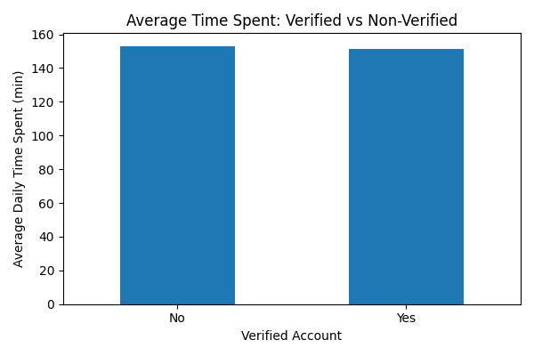

# Social Media Engagement Analysis
This project analyzes social media engagement using Python.
Tools used:
- Python
- Pandas
- Matplotlib
- Seaborn

Analysis includes:
- Average time spent on platforms
- User distribution by platform
- Country-level analysis
- Verification vs engagement
- User growth trends

Key Insights:
- Facebook has the highest engagement time (~158 minutes)
- Reddit has the most users
- Verification status does not significantly impact engagement
- User registrations peaked around 2018

 Visualizations

-Average Time Spent by Platform

-Users by Platform

-Countries Distribution

-User Growth

-Verified vs Non-Verified

